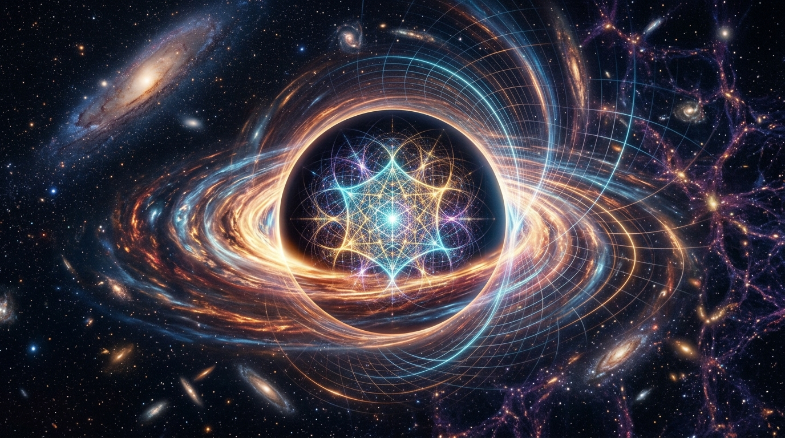

# The End of Infinite Density: Why Singularities May Not Exist and the Dual-Scale Regularization Solution

*From Navier-Stokes to Black Holes: How T-Duality and Dual-Scale Regularization rescue physical reality from mathematical infinities.*

## The Crisis of the Infinite

In both fluid dynamics and general relativity, physicists and mathematicians have been haunted by the same ghost: **The Singularity**. 

Recently, OpenAI utilized a swarm of 10,000 AI agents to formally prove that the Navier-Stokes equations can blow up in finite time—creating a point of infinite velocity. Similarly, classical General Relativity famously predicts that at the center of a black hole, spacetime collapses into an infinitely dense singularity.

But do these singularities actually exist in nature? 

Increasingly, the scientific consensus is **no**. As detailed in the recent publication [Do Black Holes have Singularities?](https://www.researchgate.net/publication/375744216_Do_Black_Holes_have_Singularities), singularities are generally understood to be artifacts of incomplete mathematical models—equations being pushed beyond their domain of physical validity. In fluid dynamics, it's the breakdown of the continuum limit (Thermodynamic Censorship). In astrophysics, it is the breakdown of classical gravity before quantum effects take over.

## T-Duality: The Universe's Built-In Cutoff

If the universe abhors a singularity, what mechanism prevents it? 

One of the most elegant answers comes from **String Theory**, specifically a property known as **T-duality**. In a universe described by string theory, there are no "point-like" particles; the fundamental constituents of reality have a finite, minimum length (the string length, $l_s$). 

T-duality reveals a profound symmetry: the physics of a universe of size $R$ is mathematically identical to a universe of size $l_s^2 / R$. 

What does this mean? If you try to crush matter into an infinitely small point ($R \to 0$), the physics begins to behave as if the space is actually growing infinitely large ($R \to \infty$). **There is no zero.** The universe possesses a built-in geometric bounce, a minimum scale that acts as an ultimate physical regulator, preventing any true singularity from ever forming.

## The Proposed Solution: Dual-Scale Regularization

We can bring this profound quantum geometric principle back to the macro-world of computational physics and fluid dynamics. If classical math forces an artificial singularity, we must introduce a computational framework that intrinsically prevents it, mirroring the regulatory mechanisms of the universe.

We introduce **Dual-Scale Regularization**.

Instead of relying on single-scale continuous grids that allow distances to shrink to absolute zero ($\Delta x \to 0$), a dual-scale solver treats the micro-scale (where kinetic and quantum effects dominate) and the macro-scale (where classical continuum equations rule) simultaneously. 

### Introducing the SocrateAI Scientific Dual-Scale Simulator

To realize this, we are developing the **[SocrateAI-Scientific-DualScaleSimulator](https://github.com/xaviercallens/SocrateAI-Scientific-DualScaleSimulator)**.

This solver operates on a paradigm inspired by T-duality and Thermodynamic Censorship. When a flow (like the OpenAI Navier-Stokes vortex) attempts to concentrate energy into a vanishingly small point, the simulator engages a secondary scale. 

1. **Macro-Scale (The Continuous):** Solves the standard Navier-Stokes PDE.
2. **Micro-Scale (The Regularizer):** As the gradient steepens and approaches the physical limit (Mach 0.3 or the Knudsen limit), the energy is deterministically shunted into a sub-grid statistical scale (representing Brownian motion, thermal noise, and viscous dissipation).

*Figure: The Dual-Scale approach ensures that enstrophy (blue line) remains bounded by physical limits, diverging entirely from the abstract mathematical singularity (red line).*

## Conclusion

The AI's proof of a Navier-Stokes singularity is a triumph of topology, but a failure of physics. Whether we are looking at the swirling vortex of a fluid or the crushed heart of a black hole, the universe does not permit infinite density. 

Through T-duality and Dual-Scale Regularization, we can build Neuro-Symbolic AI systems and CFD solvers that don't just calculate abstract math, but simulate the true, bounded nature of physical reality.

---
*MechanicaFluidorum Program · SocrateAI Lab · 2026*
