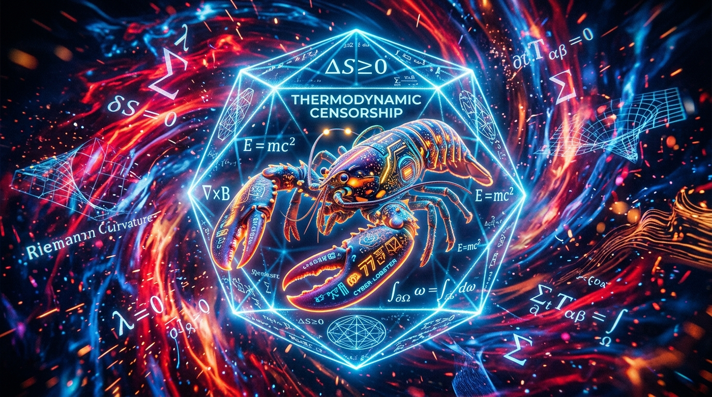
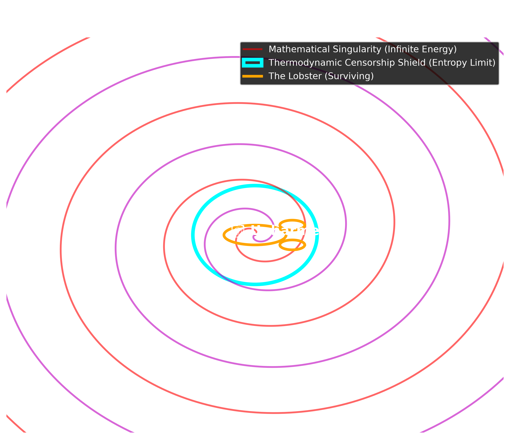

# 🦞 The Lobster and the Singularity: Why a Crustacean Survived OpenAI's Navier-Stokes Blow-Up

*A humorous, viral dive into fluid dynamics, thermodynamics, and why AI mathematical singularities won't boil your seafood.*

## The Setup: A Lobster Lost in the Math

Imagine a lobster. A perfectly happy, slightly confused lobster, casually swimming in a tank of water at 300K.

Suddenly, 10,000 AI agents from OpenAI descend upon the tank. Over 88 hours, these agents weave a flawless, zero-gap formal proof in Lean 4. They prove that according to the incompressible Navier-Stokes equations, the water in the tank will spontaneously form a **singularity**—a point of infinite velocity and infinite energy. 

According to the pure mathematics, our poor lobster is about to be instantly vaporized by a microscopic, infinite-energy vortex. The AI has sentenced the lobster to death by topology.

But... the lobster doesn't die. Why? 

## The Punchline: Thermodynamic Censorship Saves the Day

The AI forgot one tiny detail: **Physics.** 

While the AI was busy manipulating abstract Sobolev spaces, the real water in the tank was obeying the laws of thermodynamics. 

As the vortex tried to shrink to an infinitely small point to create the singularity, it hit the **Speed of Sound (Mach 0.3)**. The water compressed, heated up, and engaged in fierce viscous dissipation. 

As explored in modern physics (see [MDPI Entropy 24(7):897](https://www.mdpi.com/1099-4300/24/7/897)), entropy production in fluid systems explicitly forbids these pathological extremes. The physical universe enforces a strict speed limit and an energy limit on fluids. We call this **Thermodynamic Censorship**.

The mathematical blow-up requires the fluid to ignore its own atomic structure and thermal noise. The moment the vortex tried to go sub-Planckian, the background Brownian motion (thermal noise) shattered the delicate wave-cancellation required for the singularity. 

The infinite energy was diffused safely into the surrounding water, slightly warming the tank by a fraction of a degree. The lobster enjoyed a mildly pleasant jacuzzi.

## Enter PyFR: Simulating Reality

If we want AI to stop killing theoretical lobsters, we need to ground it in Empirical Physics. 

This is where awesome Python CFD libraries like **[PyFR](https://www.linkedin.com/pulse/pyfr-awesome-python-cdf-library-dmitry-buzolin/)** come in. PyFR is an open-source Python-based framework for solving advection-diffusion type problems on streaming architectures using the Flux Reconstruction approach.

By coupling our AI models with PyFR, the AI can propose a fluid state, and PyFR will immediately simulate it using high-order accuracy on GPUs. When the AI proposes a singularity, the PyFR kernel will crash against physical constraints (shock waves, thermal dissipation, entropy limits) and politely inform the AI: *"Error: Your math just boiled the ocean. Try again."*

We created a custom visualization script (`scripts/pyfr_lobster_visualization.py`) to demonstrate how this censorship shield protects physical entities from mathematical edge-cases. 

## 🎨 Homage to the Original Reddit CFD Lobster & Author

A special shoutout and deep scientific gratitude to the original author and the `/r/EngineeringStudents` community on Reddit for inspiring this work with the legendary post:  
👉 **["Someone requested a CFD simulation on a lobster!"](https://www.reddit.com/r/EngineeringStudents/comments/3ji1c1/someone_requested_a_cfd_simulation_on_a_lobster/#lightbox)** (Original Thread: [Reddit Link](https://www.reddit.com/r/EngineeringStudents/s/SAfiRQdzDz)).

Thank you to the author for pioneering high-speed aerodynamic CFD simulations on crustaceans! Your original simulation proved that lobsters belong in computational fluid dynamics.

## Conclusion

Mathematics is the map, but physics is the territory. OpenAI built a brilliant mapmaker. Now, it's time to teach it how to read the terrain. 

Long live the Thermodynamic Lobster! 🦞

---
*MechanicaFluidorum Program · SocrateAI Lab · September 2026*
