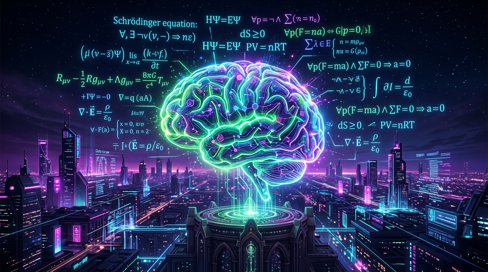
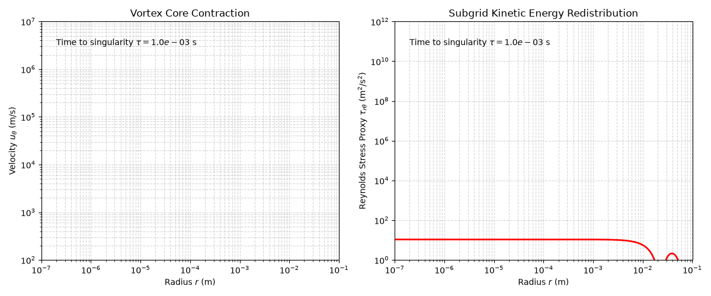

# 🌌 Projet : Audit Épistémique des Équations de Navier-Stokes par OpenAI
## 🛸 Section "Tout Public" & Citizen Science

> 🇺🇸 *"Artificial intelligence reveals the perfection of mathematics, but physics dictates reality."*
> 🇫🇷 *"L'intelligence artificielle révèle la perfection des mathématiques, mais c'est la physique qui dicte la réalité."*
> 🇨🇳 *"人工智能揭示了数学的完美，但物理学决定了现实。"*

> **Note (mise à jour v5.4.0, 2026-09-17) :** ce mémo a été corrigé lors de la révision générale du projet (v5.0.0), qui a abandonné le cadrage « vacuité physique »/« censure » ainsi que les prétentions liées à la théorie des cordes (T-dualité, K3×T²), après retours de la communauté et relecture scientifique, puis mis à jour avec les résultats de v5.4.0 (section « Où en est le projet ? »). Position actuelle : `01_Verification_Paper/OpenAI_NSE_Verification.pdf` ; liste complète des corrections, retraits et prévisions non confirmées : `CHANGELOG.md` ; version publiée : [v5.4.0](https://github.com/xaviercallens/OpenAI-NSE-Epistemic-Audit/releases/tag/v5.4.0) ; DOI : [10.5281/zenodo.22696717](https://doi.org/10.5281/zenodo.22696717).
>
> *(EN) This memo was corrected at v5.0.0 and updated for v5.4.0. Earlier claims — plasma temperatures, a "censorship" principle, the condition-number figure read as physical fragility, and the string-theory material — have been corrected or withdrawn; see `CHANGELOG.md`.*

### 🇫🇷 1. L'Héritage Français & Origine des Équations
Les équations de Navier-Stokes décrivent le mouvement de tous les fluides (eau, air, gaz) :
- 🇫🇷 **Claude-Louis Navier (1822)** : Illustre ingénieur français formé à l'*École Nationale des Ponts et Chaussées*, qui a introduit le premier les forces de frottement visqueux dans la dynamique des fluides.
- 🇬🇧 **George Gabriel Stokes (1845)** : Physicien anglo-irlandais qui a complété et formalisé les équations de transport de quantité de mouvement.

---

### ✈️ 2. Pourquoi Navier-Stokes Régit Notre Monde ?
- ✈️ **Aéronautique & Avions** : Calculer la portance des ailes ($C_L$), réduire la traînée ($C_D$) et garantir la sécurité des avions de ligne à Mach 0.85.
- 🌍 **Climat & Océans** : Modéliser la circulation atmosphérique, prévoir les ouragans et calculer le transport thermique des courants océaniques comme le Gulf Stream.

---

### ❓ 3. Le Problème du Prix du Millénaire & L'Annonce d'OpenAI
- En 2000, le *Clay Mathematics Institute* a classé la régularité de Navier-Stokes parmi les 7 **Problèmes du Prix du Millénaire** (1 million $).
- En septembre 2026, **OpenAI** a annoncé une preuve formalisée en Lean 4 (produite par un système multi-agents ; les chiffres circulant sur sa taille, « 10 000 agents », n'apparaissent dans aucune des deux publications techniques et ne sont donc pas repris ici) : un fluide peut développer une « singularité », c'est-à-dire une vitesse qui devient infinie en un point ($\vec{u} \to \infty$) alors que l'énergie totale reste bornée.
- **Notre lecture physique, en mots simples** : la preuve d'OpenAI est mathématiquement correcte, et l'énoncé du Clay autorise explicitement la force lisse qu'elle utilise. La question intéressante n'est donc pas « est-ce faux ? » mais « où le modèle continu cesse-t-il de décrire un vrai fluide ? ». Réponse : à *une seule* échelle. Comme le cœur du tourbillon garde un nombre de Reynolds d'ordre 1, sa taille suit $\ell_r \simeq \sqrt{\nu t}$ et sa vitesse $u \simeq \sqrt{\nu/t}$ ; les trois limites du modèle — compressibilité (Mach), raréfaction (Knudsen) et échauffement visqueux — deviennent importantes **ensemble** à $\ell_* = \nu/c_s$, soit $\approx 0{,}67$ nm dans l'eau et $\approx 45$ nm dans l'air. Cela arrive quelques picosecondes avant la singularité dans l'eau, quelques nanosecondes dans l'air, et *presque indépendamment de la taille initiale du tourbillon*.
- **L'échauffement** vaut exactement $\Delta T = u^2/c_p$ : environ 48 K à Mach 0,3 et 540 K à Mach 1. L'eau bout vers Mach 0,37, environ 4 ps avant la singularité — c'est chaud, ce n'est pas un plasma. Aucune loi de la thermodynamique n'est violée : c'est l'hypothèse de température découplée qui tombe.
- **Dans un liquide, la cavitation arrive en premier** : la dépression au cœur du tourbillon atteint la pression de vapeur dès $u \approx 14$ m/s, soit environ 5–6 ns avant la singularité, alors que le cœur mesure encore 70–80 nm — trois décades avant la limite de Mach. (Même la résistance à la traction de l'eau, ~30 MPa, est atteinte vers 20 ps.)
- **Une seule condition d'admissibilité** résume tout cela : $|\omega| \lesssim c_s^2/\nu$ (soit $\approx 2{,}2 \times 10^{12}\ \mathrm{s^{-1}}$ dans l'eau), ce qui équivaut à Mach $\lesssim 1$ *et* Knudsen $\lesssim 1$. Avec cette borne, « rester admissible $\Rightarrow$ rester régulier » n'est pas un axiome mais le théorème de Beale–Kato–Majda.

---

### 🌪️ Singularity vs Turbulence / Singularité vs Turbulence / 奇点与湍流

  
  

**🇺🇸** In abstract mathematics, the velocity and the energy *density* concentrate without bound while the total energy stays bounded (as seen in the vortex contraction animation). In physical reality, the continuum model stops applying at the molecular scale and energy dissipates into chaos (turbulence).
**🇫🇷** Dans les mathématiques abstraites, la vitesse et la densité d'énergie se concentrent sans limite, l'énergie totale restant bornée. Dans la réalité, le modèle continu cesse de s'appliquer à l'échelle moléculaire et l'énergie se dissipe dans le chaos (turbulence).
**🇨🇳** 在抽象数学中，速度和能量密度无限集中，而总能量保持有界。在物理现实中，连续介质模型在分子尺度失效，能量消散为混沌（湍流）。

---

### 🧠 The Neuro-Symbolic AI & LeanFlow / L'IA Neuro-Symbolique et LeanFlow / 神经符号人工智能与 LeanFlow

**🇺🇸 Our Proposal:** proof assistants that handle physically motivated equations should carry an explicit *model-validity* layer, so that a kernel-checked result is labelled as a theorem about a model rather than a statement about fluids. The predicates are simple and dimensionally derived (Mach, Knudsen, Eckert, and the vorticity bound above). We are developing this alongside **[LeanFlow](https://github.com/xaviercallens/SocrateAI-Numeric-DualScale-Solver)**, a two-scale solver. To be clear about status: in this repository one Lean file is stated on OpenAI's own definitions and proves, with no extra hypothesis, that their blow-up candidate must exceed every velocity-gradient bound near the singular time (in plain words: if the velocity blows up, so do its gradients). That is a first bridge; the validity layer inside a prover is still a proposal, not a built system.

**🇫🇷 Notre Proposition :** les assistants de preuve qui manipulent des équations issues de la physique devraient embarquer une couche explicite de *validité du modèle*, afin qu'un résultat vérifié par le noyau soit étiqueté comme un théorème *sur un modèle*, et non comme un énoncé sur les fluides. Les prédicats sont simples et obtenus par analyse dimensionnelle (Mach, Knudsen, Eckert, et la borne de vorticité ci-dessus). Nous développons cela en parallèle de **[LeanFlow](https://github.com/xaviercallens/SocrateAI-Numeric-DualScale-Solver)**, un solveur bi-échelle. Précision honnête : dans ce dépôt, un fichier Lean est énoncé sur les définitions mêmes d'OpenAI et démontre, sans hypothèse supplémentaire, que leur candidat dépasse toute borne sur le gradient de vitesse à l'approche de l'instant singulier (en clair : si la vitesse explose, ses gradients aussi). C'est un premier pont ; la couche de validité intégrée à un assistant de preuve reste une proposition, pas un système achevé.

**🇨🇳 我们的建议：** 处理物理方程的证明助手应当包含明确的**模型有效性**层，使经内核验证的结果被标注为关于某个模型的定理，而非关于真实流体的陈述。相关判据简单且可由量纲分析导出（马赫数、克努森数、埃克特数，以及上述涡量上界）。我们正与双尺度求解器 **[LeanFlow](https://github.com/xaviercallens/SocrateAI-Numeric-DualScale-Solver)** 一同推进。需要说明：本仓库中有一个 Lean 文件直接基于 OpenAI 自己的定义，在不附加任何假设的情况下证明：其爆破候选解在奇点时刻附近必然超出任何速度梯度上界（通俗地说：速度爆破必然伴随梯度爆破）。这只是第一座桥梁；集成在证明助手中的有效性层仍属提案。

---

### 🌐 Citizen Science / Science Citoyenne / 公民科学

**🇺🇸 Experiment:** We created an interactive Google Colab Notebook (link above). Test our small numerical solver and understand physical limits yourself!
**🇫🇷 Expérimentez :** Nous avons créé un Notebook Colab interactif (lien ci-dessus). Testez notre petit solveur numérique !
**🇨🇳 实验：** 我们创建了一个交互式 Google Colab 笔记本（上方链接）。测试我们的小型数值求解器！

---

### 📌 Où en est le projet ? / Project status

- **Version publiée : v5.4.0** (17 septembre 2026) — [notes de version](https://github.com/xaviercallens/OpenAI-NSE-Epistemic-Audit/releases/tag/v5.4.0). Depuis la révision scientifique complète de v5.0.0, chaque affirmation est soit dérivée, soit vérifiée contre les publications d'OpenAI et leur code Lean, soit explicitement étiquetée comme hypothèse. Les retraits — et les prévisions qui ne se sont pas confirmées — sont listés dans `CHANGELOG.md`.
- **Ce que v5.4.0 a testé : « les molécules arrêtent-elles le tourbillon ? »** Notre intuition était qu'un « verrou » physique stoppe l'effondrement à l'échelle moléculaire. Pour un gaz, l'échelle $\ell_*$ est le libre parcours moyen à une constante près ($\ell_*/\lambda = 0{,}67$ dans l'air). La théorie cinétique exacte (modèle BGK) montre pourtant qu'à ces échelles l'amortissement est *plus faible* que la viscosité, ne dépasse jamais la fréquence de collision, et que le mode « fluide » cesse d'exister à $k\lambda = \sqrt{\pi/2}$. Une simulation cinétique non linéaire (solveur Rust, 2D, isotherme) d'un effondrement entretenu **n'a montré aucun arrêt** : le cœur a même devancé Navier–Stokes de jusqu'à 12 %, et son point d'arrêt apparent suivait la finesse de la grille, pas le libre parcours moyen. Conclusion honnête : à $\ell_*$, la description fluide *se termine*, mais rien dans ce modèle n'arrête le cœur. La compressibilité et l'échauffement (absent d'un modèle isotherme) restent les candidats ouverts, et les liquides ne sont pas des gaz dilués.
- **Une prévision démentie, publiée comme telle** : nous attendions qu'une simulation 96³ montre une régularisation l'emportant sur le forçage ; aucun des six calculs ne l'a montré. Les cœurs ralentissent pourtant presque jusqu'à l'arrêt vers $1{,}2$–$1{,}5\sqrt{\alpha'}$ — c'est suggestif, pas encore convergé, et cela concerne un *modèle*, pas l'eau réelle.
- *(EN) v5.4.0 tested whether molecular (kinetic) physics stops the collapse at the mean free path. It does not in the model we could run: the fluid description ends there, but a validated 2D isothermal kinetic simulation found no arrest. A Lean bridge on OpenAI's own definitions now needs no extra hypothesis. A forecast about a 96³ run failed and is reported as failed.*
- **Relecture externe reçue le 15 septembre 2026** (texte intégral : `01_Verification_Paper/PEER_REVIEW_2026-09-15.md`). Le relecteur retient comme points forts l'unification des limites à l'échelle $\ell_*$ et la borne locale reliée au critère de Beale–Kato–Majda, le seuil de cavitation, la requalification de l'argument acoustique (qui n'est qu'une reformulation du critère de Mach), et la transparence sur les éléments retirés. Il demande des changements de présentation — commentaires sur les versions antérieures déplacés en annexe, pseudonymes de la communauté déplacés dans les remerciements, tableaux reconstruits : **ces révisions ont été faites en v5.1.0**.
- **Merci à la discussion r/FluidMechanics**, dont les objections ont directement façonné plusieurs sections du projet. / *Thanks to the r/FluidMechanics discussion, whose objections shaped several parts of this work.*
- Pour écrire au projet : [GitHub Discussions](https://github.com/xaviercallens/OpenAI-NSE-Epistemic-Audit/discussions). *(EN) To reach the project, use GitHub Discussions.*
