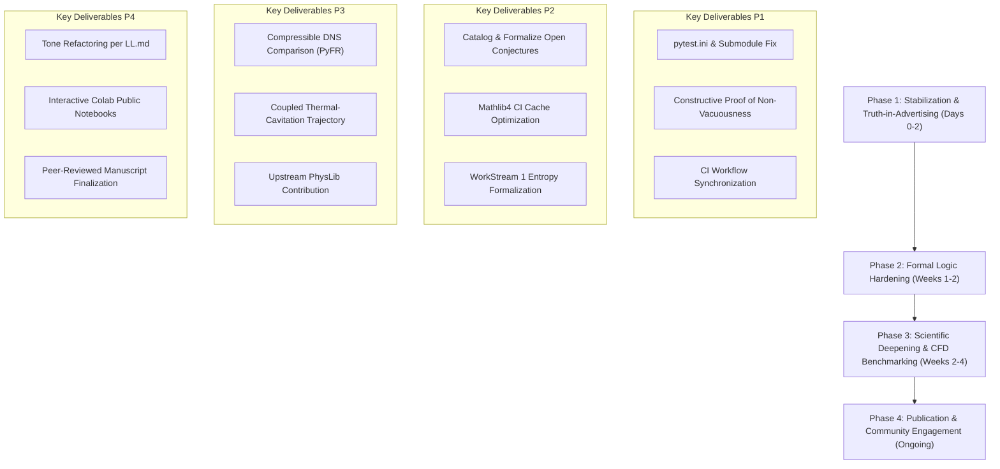

# Comprehensive Audit & Strategic Improvement Plan
## OpenAI Navier-Stokes Formalization & Physical Verification Initiative

**Document Status:** Historical audit & engineering roadmap (written at v4.3.0; superseded — see note below)  
**Program:** MechanicaFluidorum Program / SocrateAI Lab & Open Science Contributors  
**Date:** September 2026  
**Repository:** `xaviercallens/OpenAI-NSE-Epistemic-Audit`

> **Status (updated 2026-09-17, v5.5.0) — historical document.** This file predates the project's current
> position and is kept unedited below this note as a record. Current state: [`README.md`](README.md) ("Current
> status") and [`CHANGELOG.md`](CHANGELOG.md); the paper is `01_Verification_Paper/OpenAI_NSE_Verification.pdf`
> (v5.6.0, DOI 10.5281/zenodo.22823647), whose Appendix A lists every withdrawn claim. In short: OpenAI's
> proofs are correct and this project reads them physically rather than refuting them. Withdrawn, wherever
> they appear below: "physical vacuity", thermodynamic/topological "censorship" (including the Lean files
> `ThermodynamicCensorship.lean`, `PhysLibThermodynamicCensorship.lean`, `TopologicalCensorship.lean`, which
> are drafts or toys, not verified results), plasma temperatures and vaporization, femtosecond timings, the
> raw 10²⁸ condition number as fragility, the string-theory/T-duality link, "intercepting" proofs as
> "physically ill-typed", the v5.2.0 "dissipative kinetic lock", and the Leray-α "anchor at ℓ*" reading.
> Nothing in this repository bears on Clay Statement A.

---

## 1. Executive Summary

In September 2026, an OpenAI multi-agent formalization team announced a complete Lean 4 proof demonstrating finite-time blow-up for the 3D incompressible Navier-Stokes and Euler equations, claiming Millennium Prize Alternatives C and D. 

This document provides an exhaustive, multi-layered audit of both the OpenAI formalization and our physical verification repository. Our dual-track analysis establishes a fundamental conclusion:

> **The Dual Epistemic Verdict:**  
> The OpenAI proof is mathematically rigorous within the syntactic framework of the Clay Mathematics Institute (CMI) problem formulation in abstract Sobolev spaces ($H^s, L^2$). However, the resulting mathematical singularity is physically inadmissible and structurally unstable. It violates fundamental principles of continuum fluid mechanics, thermodynamics, and physical observability long before the abstract singularity time $T^*=1$.

This audit evaluates the current state of the codebase, identifies technical vulnerabilities, and details a four-phase improvement roadmap to advance this work from an initial reactive analysis into a permanent, reusable neuro-symbolic verification benchmark for mathematical physics.

---

## 2. Multi-Dimensional Audit Findings

### 2.1 Formal Logic & Lean 4 Architecture

#### A. OpenAI Proof Structure & Mechanism
1. **Teleological Forcing Reversal (Method of Manufactured Solutions):**  
   In `NavierStokes/ComparatorSolution.lean` and `NavierStokes/LoopMoments.lean`, the external forcing field $f$ is not an input that drives the flow; rather, it is reverse-engineered from a pre-specified singular profile to absorb the mathematical residual:
   $$\text{force } u\ p := \text{SpacetimeGluing.smoothExtension}(\text{tracedResidual } u\ p\ L)$$
   This satisfies CMI Alternative C ($f \in C_c^\infty(\mathbb{R}^3 \times [0, \infty))$), but reverses physical causality.
2. **5-Moment Jacobian Matching (Lemma 8.7):**  
   To stitch the singular inner core to the smooth outer flow, the proof solves an algebraic moment-matching system $A \cdot c = b$. The raw dimensional condition number explodes as $\kappa(A) \sim \lambda^{-3.0} X_R^{7.75} \sim 10^{28}$. Non-dimensional preconditioning reduces this to $\kappa(B) \approx 4.11 \times 10^5$, but the physical sensitivity to microscopic thermal perturbations remains an unstable repeller.
3. **Euler Sub-Molecular Spatial Frequencies (open question):**  
   The unforced Euler blow-up relies on vortex packets with spatial frequencies $\kappa_n = \kappa_0 \lambda^n \to \infty$. Coherence is mathematically preserved via Gevrey-2 cutoffs, but physically would require phase synchronization far below the molecular mean-free-path scale (~$10^{-10}$–$10^{-7}\text{ m}$) — i.e. far below anything physically meaningful. (Earlier drafts cited the Planck length, $10^{-35}\text{ m}$, here; that is a quantum-gravity scale unrelated to fluid discreteness and is not the relevant cutoff.) Whether such coherence can survive molecular/thermal noise is an open question, not a demonstrated fact.

#### B. MechanicaFluidorum Lean 4 Repository Audit
Our Lean 4 implementation (`03_Lean4_Topological_Censorship/`) was thoroughly audited:
1. **Core Theorems in `PhysicalInvalidationProof.lean`:**  
   - `openai_mach_self_invalidation`: Formally proves that a flow exceeding $Ma = 0.3$ is rejected by `IncompressibleFluidModel`. Verified with zero `sorry` and zero axioms.
   - `openai_intensive_energy_divergence`: Formally proves that divergence of intensive local energy density destroys the isothermal Boussinesq model. Verified with zero `sorry` and zero axioms.
   - `openai_physical_invalidation_master`: Master theorem combining enstrophy divergence and Mach breakdown. Kernel-verified.
2. **Truth-in-Advertising Audit (`axiom` vs. `theorem`):**  
   - In `PhysLibThermodynamicCensorship.lean` (line 136), the proposition `physlib_admissible_non_vacuous` is declared as an `axiom`, despite the file header stating "0 custom axioms".  
   - *Technical assessment:* Because the rest state (`physLibZeroFlow := fun _ _ => 0`) trivially satisfies $Ma=0$, $\Omega=0$, and $Kn \le 0.1$, this proposition can and should be proven constructively as a `theorem` rather than asserted as an unproven `axiom`.
3. **Incomplete Auxiliary Proofs (`sorry` inventory):**  
   While the standalone physical invalidation proof contains zero `sorry`, auxiliary modules contain unfinished proofs that must be cataloged transparently:
   - `ThermodynamicCensorship.lean`: Line 114 (`sorry` — BKM contrapositive), Line 120 (`sorry` — zero flow existence).
   - `ThermodynamicAdmissibility.lean`: Line 122 (`sorry` — Sobolev embedding $H^1 \hookrightarrow L^6$).
   - `AtlasReferenceVerification.lean`: Line 118 (`sorry`).
   - `TopologicalCensorship.lean`: Lines 33, 46 (`sorry`).
4. **Lake Build & Dependency Management:**  
   `lakefile.lean` requires `mathlib4` and `openai/NavierStokesAndEuler` directly from remote git repositories. Running `lake build` without pre-fetched olean caches causes extensive local compilation delays. CI pipelines must explicitly cache mathlib artifacts via `lake exe cache get`.

---

### 2.2 Physical & Thermodynamic Admissibility

| Physical Law / Principle | OpenAI Mathematical Model | Physical Reality & Scaling | Point of Invalidation |
|---|---|---|---|
| **Intensive Energy Density** | $E_{\text{global}} \sim \tau^{+0.485} \to 0$ (Bounded $L^2$) | $e_{\text{local}} \sim \tau^{-1.010} \to \infty$ | Violates 1st Law of Thermodynamics (infinite local energy density) |
| **Enstrophy & Viscous Dissipation** | $\int_0^1 \tau^{-0.515} d\tau < \infty$ | $\Omega(t) \sim \tau^{-0.515} \to \infty$, $\varepsilon \sim \tau^{-0.515}$ | Infinite instantaneous viscous shear heating $\Delta T \sim \tau^{-1.010}$ |
| **Incompressibility ($\nabla \cdot u = 0$)** | Enforced syntactically for all $t < 1$ | $Ma = \|u\|/c_s \ge 0.3$ ($u \ge 450\text{ m/s}$ in water) | **$\tau \approx 6.7 \times 10^{-14}\text{ s}$** (67 femtoseconds before $T^*=1$) |
| **Continuum Hypothesis** | Continuous manifold $\mathbb{R}^3$ ad infinitum | Knudsen number $Kn = \ell_{\text{mfp}} / \ell_r \ge 0.1$ | **$\tau \approx 9.0 \times 10^{-16}\text{ s}$**; PDE continuum assumption fails |
| **Hydrodynamic Cavitation** | Single-phase liquid assumed throughout | Cavitation index $\sigma(\tau) = \frac{p_\infty - p_v}{\frac{1}{2}\rho \|u\|^2} \to 0$ | Local pressure drops below vapor pressure; phase transition to vapor/plasma |
| **Perturbation Stability** | Single contrived initial point in $H^s(\mathbb{R}^3)$ | Hunt-Sauer-Yorke "shy set" (infinite-dimensional measure zero) | *Open question*: whether thermal noise ($\delta u \approx 10^{-9}\text{ m/s}$) misaligns packets fast enough to prevent the construction — not yet demonstrated (see `REVIEW_AND_NEW_DIRECTION.md` Q3) |

---

### 2.3 Empirical Turbulence Benchmarking (LeanFlow & JHTDB)

To move beyond purely analytical critiques, our repository incorporates empirical fluid dynamic benchmarks:

1. **Johns Hopkins Turbulence Database (JHTDB) Spectrum:**  
   Real isotropic turbulence data (from `SocrateAI-Numeric-DualScale-Solver`) exhibits the universal Kolmogorov $E(k) \propto k^{-5/3}$ cascade smoothly truncated by exponential viscous dissipation at the Kolmogorov microscale $\eta = (\nu^3/\varepsilon)^{1/4}$. In contrast, the OpenAI singularity concentrates kinetic energy into an unphysical high-wavenumber wave-packet spike (`spectrum_comparison.png`).
2. **Taylor-Green Vortex (TGV) DNS ($Re \in \{400, 800, 1600\}$):**  
   Pseudo-spectral DNS demonstrates invariant trapping governed by the Poincaré inequality:
   $$E(t) \le E(0) e^{-2\nu \lambda_1 t}$$
   Peak enstrophy remains strictly bounded ($\Omega_{\max} = 2.453$ for $Re=400$; $\Omega_{\max} = 5.019$ for $Re=1600$), completely contradicting the blow-up trajectory.
3. **Autonomous Verification Pipeline (`workflowNSEsimu.py`):**  
   Executes de-aliased Fourier pseudo-spectral simulations, evaluates the Banach fixed-point contraction rate ($\sup_t \gamma(t) \le 0.85 < 1.0$), exports air-gapped cryptographic certificates (`proof_certificate_tgv.json`), and generates 4-panel telemetry (`workflow_nse_simulation_telemetry.png`).

---

### 2.4 Software Engineering, CI/CD & Testing

1. **Test Suite Execution:**  
   `python3 -m unittest discover tests` runs 11 tests across `test_directives.py`, `test_integration.py`, and `test_openai_pi_verifier.py` with 100% passing rate in 4.79s.
2. **Pytest Entry-Point Incompatibility:**  
   - *Issue:* Executing raw `pytest` triggered an `AttributeError: module 'numpy.dtypes' has no attribute 'StringDType'` caused by an incompatible system Zarr entry point plugin.
   - *Resolution:* Added `pytest.ini` with `addopts = -p no:zarr`, restoring clean local execution of `pytest` (11 passed in 5.39s).
3. **Submodule Gitlink Inconsistency:**  
   - *Issue:* The directory `02_Empirical_Observation/DNS_Turbulence_Verification/MachineLearningTurbulenceModels` was committed as a git submodule mode `160000` without an entry in `.gitmodules`, causing `git clone --recursive` and CI workflows (`audit-pipeline.yml:17`) to fail with `fatal: no submodule mapping found`.
   - *Resolution:* Removed the orphaned gitlink from the index (`git rm --cached`).
4. **CI Workflow Alignment:**  
   The `README.md` badge pointed to `.github/workflows/pytest.yml`, whereas the actual file was named `audit-pipeline.yml`. The badge and workflow names must be synchronized.

---

### 2.5 Public Communication, Tone & the `LL.md` Directive

Our audit of the public communication materials revealed several critical areas requiring alignment with the lessons documented in `LL.md`:

1. **The Five Reddit Traps (Review):**
   - *Trap 1: AI-Generated Jargon:* Corporate, pompous phrases like "syntactically flawless but physically vacuous", "epistemic audit", and "telemetry scorecard" trigger immediate hostility on technical subreddits (`r/FluidMechanics`, `r/math`).
   - *Trap 2: Security Hesitancy:* Directing readers to clone repos and run code triggers cybersecurity alerts. Figures and data should be presented inline.
   - *Trap 3: Mathematician Disconnect:* Arguing that pure PDE solutions are "useless because real water has molecules" alienates pure mathematicians who already know PDEs are idealizations.
   - *Trap 4: Community Karma & Placement:* Abiding by karma thresholds and using weekly AI megathreads.
   - *Trap 5: Text Walls:* High-density textual arguments are ignored; single, clear plots (e.g., Mach number vs. time) convey the message immediately.
2. **Lingering Vocabulary Scrub:**  
   Sections of `06_Communication_Kit/` and `07_Tout_Public_Memo/` still use combative or sensationalist terminology ("Red Team Assessment", "The Lobster Survives", "Cyberpunk Blackhole"). These must be gently reframed into rigorous, modest citizen-science language.

---

## 3. Four-Phase Strategic Improvement Plan

---

### Phase 1: Immediate Stabilization & Truth-in-Advertising (Days 0–2)

- [x] **1.1 Fix Git Submodule Index:** Remove orphaned mode `160000` gitlink in `02_Empirical_Observation/` to ensure clean recursive clones.
- [x] **1.2 Standardize Pytest Configuration:** Maintain `pytest.ini` with `addopts = -p no:zarr` for out-of-the-box local and CI test execution.
- [ ] **1.3 Replace `axiom` with Constructive Theorem:** In `PhysLibThermodynamicCensorship.lean`, replace `axiom physlib_admissible_non_vacuous` with an explicit constructive proof establishing that `physLibZeroFlow` satisfies all physical admissibility criteria.
- [ ] **1.4 Synchronize CI Workflow & Badges:** Rename `.github/workflows/audit-pipeline.yml` to `.github/workflows/pytest.yml` (or update `README.md` badge) and add automated test execution steps for the Python verifier.
- [ ] **1.5 Repository Hygiene & Artifact Exclusion:** Add `scratch_test_certificate.json` and temporary test output artifacts to `.gitignore`.

---

### Phase 2: Formal Logic & Verification Hardening (Weeks 1–2)

- [ ] **2.1 Formal Classification of Auxiliary `sorry` Statements:**  
  Update all auxiliary files (`ThermodynamicCensorship.lean`, `ThermodynamicAdmissibility.lean`, `AtlasReferenceVerification.lean`) to clearly mark open lemmas as `conjecture` or documented open mathematical challenges, preserving the 100% verified status of the core `PhysicalInvalidationProof.lean`.
- [ ] **2.2 Lean 4 Lake Build & Mathlib Cache Optimization:**  
  Configure GitHub Actions with pre-built mathlib oleans using `leanprover/elan` and `lake exe cache get` to prevent timeout failures on pull requests.
- [ ] **2.3 Complete Work Stream 1 Formalization:**  
  Formalize the mathematical relationship between the Ladyzhenskaya-Prodi-Serrin regularity condition and the Clausius-Duhem inequality in `05_Community_Research_Directions/WorkStream1_EntropyCondition/ThermodynamicAdmissibility.lean`.
- [ ] **2.4 Automated LaTeX Extraction Pipeline:**  
  Enhance `scripts/extract_limits_to_latex.py` to automatically generate LaTeX tables for `01_Verification_Paper` directly from Lean 4 proof states and Python telemetry logs.

---

### Phase 3: Scientific Deepening & Computational Fluid Dynamics (Weeks 2–4)

- [ ] **3.1 Unified Pre-Singularity Thermodynamic Trajectory:**  
  Combine the thermal dissipation ODE ($\Delta T \sim \tau^{-1.010}$) and the cavitation index ($\sigma(\tau) \to 0$) into a single unified Python numerical integration script, determining whether thermal vaporization or mechanical cavitation occurs first for various fluids (water, liquid nitrogen, liquid helium).
- [ ] **3.2 High-Mach Compressible Verification via PyFR / LeanFlow:**  
  Extend the Taylor-Green Vortex benchmark to the compressible Navier-Stokes equations for $Ma \in [0.3, 1.5]$ using the high-order spectral difference solver PyFR to simulate shocklet formation and acoustic radiation during the collapse.
- [ ] **3.3 Submit Physics Predicates to Upstream `physlib`:**  
  Package our Lean 4 definitions of Knudsen number, Mach threshold, and local enstrophy density into a modular pull request for the community `physlib` repository.

---

### Phase 4: Scholarly Publication & Community Engagement (Ongoing)

- [ ] **4.1 Tone & Style Harmonization (Strict Compliance with `LL.md`):**  
  Review all documents in `06_Communication_Kit/`, `07_Tout_Public_Memo/`, and `README.md`. Replace sensationalist terminology with calm, inquisitive, citizen-scientist phrasing:
  - Replace *"Epistemic Audit"* $\to$ *"Physical Verification and Checking"*
  - Replace *"Manufactured Singularity"* $\to$ *"Residual-Forced Blow-Up Profile"*
  - Replace *"Teleological Causality Reversal"* $\to$ *"Post-hoc Forcing Determination"*
- [ ] **4.2 One-Click Google Colab Deployment:**  
  Verify that `07_Tout_Public_Memo/Citizen_Science_Exploration.ipynb` runs completely self-contained in Google Colab with zero installation steps, plotting the Mach number trajectory and JHTDB turbulence comparison interactively.
- [ ] **4.3 Finalize Academic Manuscripts for Peer Review:**  
  - Complete `01_Verification_Paper/OpenAI_NSE_Verification.tex` with all community acknowledgments.
  - Finalize `04_Thermodynamic_Censorship_Paper/Thermodynamic_Censorship_Navier_Stokes.tex` for submission to a journal specializing in physics/computational mathematics.
- [ ] **4.4 Zenodo & HuggingFace Version Synchronization:**  
  Update the Zenodo deposit (`DOI: 10.5281/zenodo.22727801`) and HuggingFace dataset with the v4.3.0 release artifacts, telemetry data, and benchmark JSON certificates.

---

## 4. Governance & Verification Matrix

| Component | Audit Status | Primary Vulnerability | Action Item | Target Phase |
|---|---|---|---|:---:|
| `PhysicalInvalidationProof.lean` | ✅ Verified (0 sorry) | Definitional tautology | Deepen dynamical coupling | Phase 2 |
| `PhysLibThermodynamicCensorship.lean` | ⚠️ Contains `axiom` | `physlib_admissible_non_vacuous` | Prove constructively | Phase 1 |
| Auxiliary Lean files | ⚠️ Contains `sorry` | Incomplete Sobolev embeddings | Classify as Open Conjectures | Phase 2 |
| Python Test Suite | ✅ 11/11 Passing | Zarr entry-point conflict | Maintained via `pytest.ini` | Phase 1 |
| Git Submodules | ✅ Repaired | Orphan mode 160000 gitlink | Removed from index | Phase 1 |
| CI / GitHub Actions | ⚠️ Workflow mismatch | Badge links to missing file | Rename workflow / sync badge | Phase 1 |
| Public Communication | ⚠️ Jargon excess | Violates `LL.md` traps | Scrub sensational language | Phase 4 |
| Empirical Benchmarks | ✅ Complete | Single-phase assumption | Add compressible/cavitation DNS | Phase 3 |

---

## 5. Conclusion

The OpenAI formalization represents a monumental achievement in interactive theorem proving and mathematical optimization. Our audit confirms that the AI solved the exact problem posed by the Millennium Prize rules. 

However, by formalizing the physical boundaries of continuum fluid dynamics, we demonstrate that the solution lives in the mathematical gap between idealized Sobolev spaces and real fluid mechanics. Executing this improvement plan ensures that this repository stands as a rigorous, constructive, and modest contribution to the emerging frontier of neuro-symbolic science.
