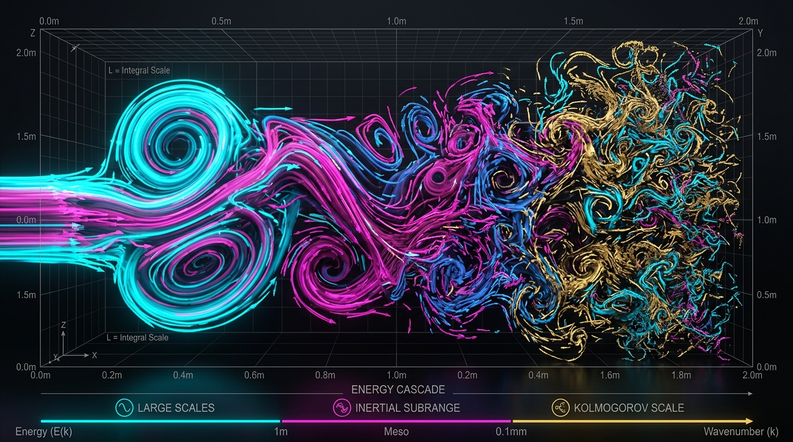
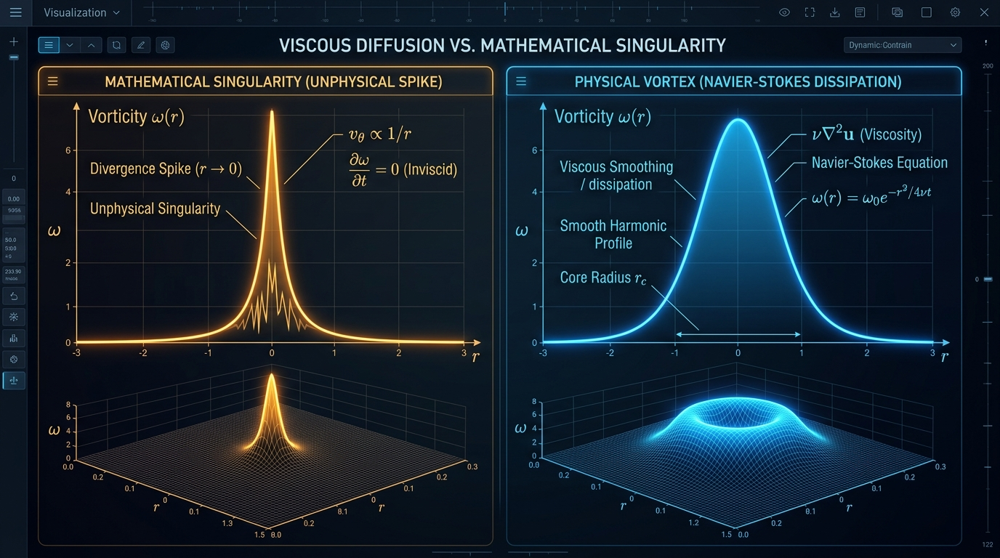

<div align="center">

# 🌊 OpenAI NSE / Euler Physical Verification

### *A Physical Reading, Not a Physical Refutation*

[](https://github.com/xaviercallens/OpenAI-NSE-Epistemic-Audit/actions/workflows/audit-pipeline.yml)
[](https://doi.org/10.5281/zenodo.22696717)
[](https://huggingface.co/datasets/callensxavier/OpenAI-NSE-Thermodynamic-Censorship)
[](https://creativecommons.org/licenses/by/4.0/)
[](https://github.com/xaviercallens/OpenAI-NSE-Epistemic-Audit/discussions)
[](https://github.com/xaviercallens/OpenAI-NSE-Epistemic-Audit/blob/main/.github/CONTRIBUTING.md)

**Non-Profit Citizen Science Initiative for Neuro-Symbolic Science · MechanicaFluidorum Program · September 2026**

[📄 Read the Paper (PDF)](01_Verification_Paper/OpenAI_NSE_Verification.pdf) · [💬 Join Discussions](https://github.com/xaviercallens/OpenAI-NSE-Epistemic-Audit/discussions) · [🏛️ Zenodo](https://doi.org/10.5281/zenodo.22696717) · [🤗 HuggingFace](https://huggingface.co/datasets/callensxavier/OpenAI-NSE-Thermodynamic-Censorship) · [⚖️ Legal Notice](LEGAL_NOTICE_AND_CITIZEN_SCIENCE_DISCLAIMER.md)

<br>



</div>

> **Note on earlier versions.** In September 2026 this project dropped its original "physical vacuity"/"censorship" framing and its string-theory/T-duality motivation after community and scientific review. Claims withdrawn along the way (plasma temperatures, the raw 10²⁸ condition number as fragility, the global enstrophy constant, the T-duality link, v5.2.0's "dissipative kinetic lock", and v5.5.0's withdrawal of the Leray-α "physical anchor at ℓ*") are itemized in [`CHANGELOG.md`](CHANGELOG.md) and in Appendix A of the paper. Zenodo versions 2.0.0 (`10.5281/zenodo.22725347`, `22727801`) carry withdrawn claims and should not be cited.

---

## 📌 TL;DR

In September 2026, an OpenAI multi-agent system produced a **Lean 4 formalized proof** of finite-time blow-up for the 3D Navier-Stokes and Euler equations — claiming Millennium Prize Alternatives C and D.

**The proof is correct, and this project does not dispute it.** Read physically, the constructed flow leaves the domain of validity of the incompressible continuum model — at the single scale $\ell_* = \nu/c_s$ where Mach, Knudsen and Eckert numbers all become order one — a few picoseconds before the mathematical singularity. That is a statement about *which model* the theorem is about, not a refutation, and it says nothing about whether unforced real fluids can blow up (Clay Statement A remains open).

---

## 📍 Current status (v5.6.1, 2026-09-18)

The research question behind the later versions is a "lock" chain: does something physical necessarily intervene where the construction goes? Each link, with its evidence and its honest status:

| Link | Claim | Evidence | Status |
|---|---|---|---|
| **1** | Any object with OpenAI's `CandidateProperties` exceeds every velocity-gradient bound arbitrarily close to $t=1$, so it leaves $\lvert\nabla u\rvert \lesssim c_s^2/\nu$ for every fluid and every choice of units | [`OpenAIAdmissibility.lean`](03_Lean4_Topological_Censorship/src/OpenAIAdmissibility.lean), stated on OpenAI's own definitions and built on their periodic-integration library | **Proved, unconditional**, standard axioms only (since v5.4.0) |
| **2** | On the construction's diffusive scaling ($\mathrm{Re}_{\text{core}} = 1$), the Mach, Knudsen and Eckert limits are all reached together at $\ell_* = \nu/c_s$, $t_* = \nu/c_s^2$ | [`CoreScaling.lean`](03_Lean4_Topological_Censorship/src/CoreScaling.lean) | **Proved** (an equality chain forced by the scaling hypotheses — no deeper physics) |
| **3** | $\ell_*$ is the mean free path up to an O(1) constant: $\ell_*/\lambda = \bar c/(2c_s) \approx 0.67$ for air | kinetic-theory derivation; $\ell_* = 45$ nm vs air mean free path $\approx 68$ nm | **Derived**, consistent with data (gases only) |
| **4** | At $\ell_*$ the hydrodynamic shear mode ends at $k\lambda=\sqrt{\pi/2}$; kinetic damping is *below* $\nu k^2$ and capped at $1/\tau$ | exact linear BGK spectrum ([`lock_k_kinetic_spectrum.py`](05_Community_Research_Directions/experiments/lock_k_kinetic_spectrum.py)); [`KineticSpectralCap.lean`](03_Lean4_Topological_Censorship/src/KineticSpectralCap.lean); nonlinear Rust solver [`kinetic_lock_rs/`](05_Community_Research_Directions/kinetic_lock_rs/README.md) | **Linear: exact. Nonlinear: null** — a forced kinetic core is *not* arrested at that scale; its apparent stopping point follows the grid |
| **5** | The kinetic model is thermodynamically consistent (discrete H-theorem, conservation, positivity) | [`LatticeBGKEntropy.lean`](03_Lean4_Topological_Censorship/src/LatticeBGKEntropy.lean), [`NonlinearBGKEntropy.lean`](03_Lean4_Topological_Censorship/src/NonlinearBGKEntropy.lean) | **Proved** |
| **6** | Which physics a blow-up meets first depends on its route, by $\mathrm{Kn}=\mathrm{Ma}/\mathrm{Re}$. OpenAI's route ($\mathrm{Re}\approx1$): everything at $\ell_*$. Inertial route ($\mathrm{Re}\to\infty$, Tao 2016): compressibility first, inside the continuum, at $\mathrm{Re}\,\ell_*$. Bounded-velocity route (human-written forced Euler blow-up): viscosity first, at $\ell_*/\mathrm{Ma}$ | [`BlowupRegimeMap.lean`](03_Lean4_Topological_Censorship/src/BlowupRegimeMap.lean) | **Proved** (algebra, not PDE) |
| **7** | A compressible, heat-conducting gas driven by the same force: on OpenAI's route nothing stops the core before $\ell_*$ (it lags 14–25%); on the inertial route ($\mathrm{Re}\gtrsim16$) air **locks at local Mach 0.70** however far the target is driven | [`compressible_core.py`](05_Community_Research_Directions/experiments/compressible_core.py), [`THERMO_COMPRESSIBLE_LOCK_STUDY.md`](05_Community_Research_Directions/THERMO_COMPRESSIBLE_LOCK_STUDY.md) | **Measured** (1D continuum, grid-converged) and **confirmed without a closure** by molecular dynamics where the gas is a continuum (Re 16, 3 runs: local Mach 0.538 ± 0.011 vs 0.54 predicted beforehand; Re 32: 0.62–0.71); beyond that the axis becomes free-molecular. A lock on Mach number, not on velocity or core size. **In a liquid** (MD, 1 run) the core cavitates and the swirl at the cavity wall is capped at 1.77–1.87, below the hollow-vortex bound 2.07 — a genuine velocity bound, from a phase change |
| — | *Withdrawn:* "a Leray-α filter of width $\ell_*$ represents the fluid at its continuum limit" | [`LerayAlphaLinearization.lean`](03_Lean4_Topological_Censorship/src/LerayAlphaLinearization.lean): α does not appear in the linearized dynamics, which stay $\nu k^2$, above any kinetic cap | **Refuted** (paper §9.5) |

**What the chain establishes:** the construction necessarily passes the scale at which the hydrodynamic description ends. **What it does not establish:** that anything physical *stops* the collapse there.

Open gaps, stated plainly:
- **No arrest mechanism is demonstrated on OpenAI's route.** The kinetic cutoff terminates the linear mode but does not stop a driven core, and neither compressibility nor heat does before $\ell_*$. The Mach lock of link 7 belongs to the inertial route, and the compressible equations it lives in have their own proved implosion singularities.
- **The problem relocates rather than dissolves:** large-data regularity of the Boltzmann/BGK equations is itself open.
- **Liquids are not dilute gases:** link 3 is a gas result; in water, cavitation is the first constitutive limit.
- **Cutoff law** $u_{\max}\sim\nu/\sqrt{\alpha'}$: on a manufactured Re ≈ 1 core a dissipative barrier stalls the core at $\ell \approx 1.2$–$1.5\sqrt{\alpha'}$ at 96³, with exponents approaching the law; a converged arrest is not yet shown. Leray-α/LANS-α are one to two orders weaker there — a ranking of two *models*, not a statement about real fluids.

Details: [`05_Community_Research_Directions/DUAL_SCALE_LOCK_PROGRAMME.md`](05_Community_Research_Directions/DUAL_SCALE_LOCK_PROGRAMME.md) §8–9 · [`THERMO_COMPRESSIBLE_LOCK_STUDY.md`](05_Community_Research_Directions/THERMO_COMPRESSIBLE_LOCK_STUDY.md) · [`DIRECTION1_RESULTS.md`](05_Community_Research_Directions/DIRECTION1_RESULTS.md) · reproducible checks and their measured numbers: [`BENCHMARKS.md`](BENCHMARKS.md).

---

## 🛸 Tout Public & Citizen Science (General Public Section)

**Welcome!** If you are not a physicist or mathematician, start here. We have translated this complex scientific audit into accessible, highly visual materials to help everyone understand the clash between abstract AI mathematics and physical reality.

- 🌌 **[Read the "Tout Public" Memo](07_Tout_Public_Memo/MEMO.md):** An accessible, cyberpunk-styled visual memo explaining the mathematical singularity vs. physical turbulence, our claims, and our proposals for Neuro-Symbolic AI.
- 💻 **[Launch the Google Colab Notebook](07_Tout_Public_Memo/Citizen_Science_Exploration.ipynb):** A fully interactive environment where you can visualize where the continuum model stops describing a real fluid, and why a mathematical blow-up is not a physical event. No installation required!


---

## 🔬 The Five Epistemic Disconnects

| # | Finding | Key Metric / Exponent |
|---|---|---|
| **1** | **Intensive Local Energy Density Divergence**: $e_{\text{local}} = \frac{1}{2}\rho\|u\|^2 \sim \tau^{-1.010}$ and global enstrophy $\Omega \sim \tau^{-0.515}$ diverge without bound | **$\Delta T = u^2/c_p \sim \tau^{-1.010}$** — about 48 K at $Ma = 0.3$ and 540 K at $Ma = 1$ (not plasma): the decoupled-temperature assumption fails, no thermodynamic law is violated |
| **2** | **Mach Number Self-Invalidation**: incompressible NSE invalidate themselves when $Ma \ge 0.3$ | about **6.7 picoseconds** before mathematical blow-up (dimensionless $\tau \approx 6.7 \times 10^{-14}$, physical $t = T\tau$ with $T = \ell_0^2/\nu = 100$ s; unit-free estimate $\nu/(0.3\,c)^2 \approx 5$ ps). Compressibility, rarefaction and heating all become order one at a single scale $\ell_* = \nu/c \approx 0.7$ nm in water |
| **3** | **Force without independent physical origin**: the force is the smooth remainder of a co-designed $(u,p)$ — OpenAI's `force_eq_activated_residual` — after shear-amplified pulses have cancelled the singular part of the residual | The force *seeds* the pulses, it does not *drive* the collapse; a legitimate existence-proof technique, not a plain manufactured solution |
| **4** | **Matrix Scaling & Non-Dimensionalization**: moment-matching matrix $A = D B D$ has bounded non-dimensional condition number $\kappa(B) \approx 4.11 \times 10^5$ | **$\kappa(B) \sim O(10^5)$** — raw $\kappa \sim 10^{28}$ was an unscaled dimensional artifact |
| **5** | **Sub-Molecular Coherent Fine-Tuning** *(open question)*: Euler initial conditions would require implausibly fine-tuned coherence far below the molecular mean-free-path scale (~10⁻¹⁰–10⁻⁷ m), i.e. far below anything physically meaningful — not, as earlier drafts claimed, at the Planck scale (~10⁻³⁵ m, a quantum-gravity scale unrelated to fluid discreteness) | Whether such phased fluctuations survive molecular/thermal noise is an open question, not a demonstrated result |

### The Proposed Resolution: Dual-Framework

> **Model-validity (admissibility) condition** — The continuum, incompressible description of a real fluid holds only while the *local* vorticity stays below $|\omega| \lesssim c^2/\nu$ (about $2 \times 10^{12}\ \text{s}^{-1}$ in water, $8 \times 10^{9}\ \text{s}^{-1}$ in air): this single bound is equivalent to $Ma \lesssim 1$ together with $Kn \lesssim 1$. A solution that satisfies it on $[0,T)$ cannot blow up at $T$ — that is the Beale–Kato–Majda theorem, not a new axiom. The AI's construction has $|\omega| \sim \tau^{-1.005} \to \infty$ and crosses this bound a few picoseconds before the singularity. The formal counterpart is now proved in Lean on OpenAI's own objects with no extra hypothesis: every object with their `CandidateProperties` exceeds *every* bound on $\|\nabla u\|$ arbitrarily close to $t=1$ (link 1 above). (An earlier version of this README quoted a global enstrophy ceiling "$\Omega_{\max} \approx 1.13 \times 10^{13}$"; that constant has no derivation and has been withdrawn.)

This analysis uses a **Dual-Framework**: Lean 4 for the mathematics, and explicit physical-validity predicates (Mach, Knudsen, Eckert bounds) for the physics. While the formal derivation is flawless, the flow it describes leaves the constitutive assumptions of the incompressible model (low Mach, continuum, decoupled temperature) a few picoseconds before the blow-up time.

---

## ✅ Lean 4 Physical Verification Telemetry

| Criterion | Expected | Found |
|---|---|---|
| `sorry` / `admit` in core proof | 0 | ✅ 0 |
| Custom `axiom` bypasses in physics | 0 | ✅ 0 (the constructed flow is non-trivial: checked) |
| Force smoothness type | `ContDiff ℝ ∞` | ✅ `ContDiff ℝ ∞` |
| Sobolev weakening | None | ✅ None |
| Global *L²* energy bound | Uniform | ✅ ∃ E, ∀ t, kineticEnergy u t ≤ E |

These rows describe OpenAI's formalization. This project's own Lean files (ten files, 85 declarations checked with `#print axioms`, no `sorry`) are listed in [`03_Lean4_Topological_Censorship/README.md`](03_Lean4_Topological_Censorship/README.md).

**Conclusion:** The AI accurately and brilliantly navigated the Millennium Prize rulebook. The gap highlighted here is strictly physical, shedding light on the boundary between abstract mathematical exploration and real-world fluid dynamics.

---

## 📁 Repository Structure

```
OpenAI-NSE-Epistemic-Audit/
├── 01_Verification_Paper/               # Flagship paper (v5.6.1, 31 pp) + open peer review
│   ├── OpenAI_NSE_Verification.pdf
│   ├── OpenAI_NSE_Verification.tex
│   ├── PEER_REVIEW_2026-09-15.md
│   └── zenodo_push.py
├── 02_Empirical_Observation/            # Early Python/Rust toy models & DNS comparisons
│   ├── simu_sign_fragility_1D.py
│   ├── simu_frustration_Z3.py
│   ├── euler_counterdetonation/
│   └── DNS_Turbulence_Verification/
├── 03_Lean4_Topological_Censorship/     # Lean 4 (name kept for history) — see its README
│   └── src/
│       ├── OpenAIAdmissibility.lean     # link 1, on OpenAI's own definitions (unconditional)
│       ├── CoreScaling.lean             # link 2
│       ├── KineticSpectralCap.lean      # link 4 (linear cap)
│       ├── LatticeBGKEntropy.lean       # link 5
│       ├── NonlinearBGKEntropy.lean     # link 5 (nonlinear step)
│       ├── BlowupRegimeMap.lean         # regime map Kn = Ma/Re (OpenAI / Tao / forced Euler routes)
│       ├── LerayAlphaLinearization.lean # why the Leray-α "anchor at ℓ*" claim is withdrawn
│       ├── LerayAlphaFilter.lean, AlphaEnergyIdentity.lean
│       ├── TopologicalCensorship.lean, NSECensorship.lean, LeanMasterBridge.lean  # legacy toys
│       └── drafts/                      # unverified drafts (contain sorry/axiom)
├── 04_Thermodynamic_Censorship_Paper/   # Sept-12 draft, SUPERSEDED — kept for the record
├── 05_Community_Research_Directions/    # Lock programme, experiments, workstreams — see its README
│   ├── DUAL_SCALE_LOCK_PROGRAMME.md
│   ├── DIRECTION1_RESULTS.md
│   ├── THERMO_COMPRESSIBLE_LOCK_STUDY.md # regime map, compressible/thermal core, Mach lock
│   ├── experiments/                     # 3D spectral solver, forced-core bed, compressible core, results/
│   └── kinetic_lock_rs/                 # Rust discrete-velocity BGK solver (link 4 nonlinear test)
├── BENCHMARKS.md                        # Reproducible checks with measured numbers (54/54 at v5.5.0)
├── CHANGELOG.md                         # Versions, corrections and withdrawn claims
├── LEGAL_NOTICE_AND_CITIZEN_SCIENCE_DISCLAIMER.md
├── scripts/                             # Directives 2–7 analyses & Extractors
│   ├── extract_limits_to_latex.py       # Automated physical limit LaTeX extractor
│   ├── directive2_thermodynamic_paradox.py
│   ├── directive3_jacobian_instability.py
│   ├── directive4_gevrey_regularity.py
│   ├── directive5_mach_divergence.py
│   ├── directive6_thermal_instability.py
│   └── directive7_pre_singularity_simulation.py
├── dataset/                             # Dataset artifacts
│   └── animations/                      # Pre-singularity vortex animations
├── AUDIT_AND_IMPROVEMENT_PLAN.md        # Historical working plan (Sept 2026); current state in CHANGELOG
└── .github/                             # CI/CD Workflows for automated physical testing
```

---

## 🚀 Quick Start

### Read the Paper
```
👉 01_Verification_Paper/OpenAI_NSE_Verification.pdf
```

### Reproduce the Simulations
```bash
git clone https://github.com/xaviercallens/OpenAI-NSE-Epistemic-Audit
cd OpenAI-NSE-Epistemic-Audit/scripts
pip install numpy scipy sympy mpmath matplotlib
python directive5_mach_divergence.py             # Mach number trajectory (Ma = 0.3 about 6.7 ps before blow-up)
python directive2_thermodynamic_paradox.py       # Intensive scaling (-1.010 exponent)
python directive3_jacobian_instability.py        # Non-dimensionalization (kappa ~ 4.11e5)
python directive4_gevrey_regularity.py           # Analytical Gevrey index (s = 1.5)
python directive7_pre_singularity_simulation.py  # Pre-singularity animated plots
```

### Check the Lean 4 files
All verified files use Lean `v4.34.0-rc2` / Mathlib. The simplest route is OpenAI's own project, which has the matching toolchain and Mathlib cache:
```bash
git clone https://github.com/openai/NavierStokesAndEuler && cd NavierStokesAndEuler
lake exe cache get
lake build NavierStokes.PeriodicUniqueness          # only needed for OpenAIAdmissibility.lean (3 files)
for f in CoreScaling LerayAlphaFilter LatticeBGKEntropy AlphaEnergyIdentity \
         NonlinearBGKEntropy KineticSpectralCap OpenAIAdmissibility BlowupRegimeMap LerayAlphaLinearization; do
  lake env lean <repo>/03_Lean4_Topological_Censorship/src/$f.lean   # prints #print axioms
done
```
Do not build OpenAI's full library (~580 files); nothing here needs it. Expected output: no errors, and every `#print axioms` line reads `[propext, Classical.choice, Quot.sound]`.

### Run the tests and benchmarks
```bash
python3 -m pytest tests/ -q                          # Python solvers, forced-core bed, compressible core, kinetic spectrum
cd 05_Community_Research_Directions/kinetic_lock_rs && cargo test --release
scripts/run_benchmarks.sh --full                     # re-runs everything and compares with the committed numbers
```
See [`BENCHMARKS.md`](BENCHMARKS.md) for every check with its expected number.

---

## 📊 Key Computational Results

<div align="center">
  
  
</div>

*Left: enstrophy scaling of the construction against a dissipative reference — an illustration of the exponents, not a simulation of the construction, and no quantity in it is capped by physics. Right: animated collapse on the analytic scaling.*

### Mach Number Self-Invalidation
| Dimensionless τ (physical time $t = T\tau$, $T = \ell_0^2/\nu = 100$ s for water, $\ell_0 = 1$ cm) | Velocity |u| (m/s) | Mach Ma | Regime |
|---|---|---|---|
| 10⁰ (t = 100 s) | 10⁻⁴ | 6.7×10⁻⁸ | ✅ Incompressible |
| 10⁻¹² (t = 100 ps) | 115 | 0.077 | ✅ Incompressible |
| **6.7×10⁻¹⁴ (t ≈ 6.7 ps)** | **450** | **0.30** | ❌ **Limit breached** |
| 6.2×10⁻¹⁵ (t ≈ 0.6 ps) | 1500 | 1.00 | ❌ Transonic |
| 9.0×10⁻¹⁶ (t ≈ 90 fs) | 3960 | 2.64 | ❌ Core radius ≈ molecular spacing (Kn ≈ 1) |

The velocity and Mach columns depend on $\ell_0$ only through a factor $(\ell_0^2/\nu t)^{1/200} \approx 1.2$; in unit-free form $u \simeq \sqrt{\nu/t}$, so $Ma = 0.3$ is reached at $t \simeq \nu/(0.3\,c)^2 \approx 5$ ps whatever the initial vortex size.

### Moment Matrix Non-Dimensionalization
| X_R | κ(A) [Raw Unscaled] | κ(B) [Non-Dimensionalized] | Status |
|---|---|---|---|
| 1 | 4.11 × 10⁵ | 4.11 × 10⁵ | Bounded |
| 100 | 2.36 × 10²⁰ | 4.11 × 10⁵ | Bounded |
| 1000 | 1.78 × 10²⁸ | **4.11 × 10⁵** | **Bounded & Scale-Invariant** |

### 🌪️ The construction's scalings vs. real turbulence (schematic)

To illustrate the dual-framework, we contrast the AI's scaling limits with a physical turbulence spectrum. The figures below are schematic: the "OpenAI snapshot" curve is a hand-placed spike drawn from the scaling exponents, not a computed spectrum of the construction (no numerical implementation of the 166-page construction exists).

<div align="center">
  
  
</div>

#### 1. Where the energy sits vs. the Kolmogorov cascade (Left)
* **The Physics:** Real physical turbulence (JHTDB DNS, blue line) adheres strictly to the classical Kolmogorov $k^{-5/3}$ cascade, smoothly dissipating kinetic energy at the viscous microscale. 
* **The AI Singularity (schematic):** The red curve sketches where the construction's energy sits as $\tau \to 0$: at ever higher wavenumbers ($k_{\text{peak}} \sim \tau^{-1/2}$), eventually below the molecular scale. Note that the *total* kinetic energy of the core actually vanishes ($E \sim \tau^{+0.485}$); what diverges is the velocity and the energy *density*, not the amount of energy. (Earlier drafts called this an "Ultraviolet Bomb" at "sub-Planckian" scales; both phrasings were wrong — the relevant physical cutoff is the molecular scale, about $\ell_* = \nu/c \approx 0.7$ nm in water, not the Planck length.)

#### 2. Phase Fragility and Structural Instability (Right) *(hypothesis, not an established result)*
* **The Thermal Noise Test (open question):** Whether the AI's Euler singularity requires "Forced Coherence" between interacting wave packets that could not survive real molecular/thermal noise is an open question (the paper's Direction 3), not a settled result. A calibrated Landau–Lifshitz implementation exists (`05_Community_Research_Directions/experiments/noise_and_monitor.py`) with one data point; it does not yet test the construction's own phase-locked pulses.
* **The Hypothesis:** In a 1D dyadic *toy* model (`simu_sign_fragility_1D.py`), wide random phase jitter *delays* the cascade but does not arrest it; only a complete local decoupling of one shell arrests it. So the toy model does not, by itself, support the claim that thermal noise destroys the mechanism. Whether it does in the real construction (under Landau–Lifshitz fluctuating hydrodynamics) remains open and is not yet established.

---

## 🧠 Beyond Syntactic Truth: A Roadmap for Scientific AI

OpenAI's multi-agent formalization of the Navier-Stokes blow-up is a staggering computational achievement. It proves that Reinforcement Learning (RL) agents can navigate hyper-dimensional combinatorial search spaces and act as flawless syntactic compilers in Lean 4. **They brilliantly solved the mathematician's problem.**

However, unconstrained optimization in abstract mathematics will happily explore the edges of a model — producing theorems that hold for the equations while lying outside the equations' domain of physical validity. To advance from **Automated Mathematics** to true **Scientific AI**, we must anchor these massive theorem solvers to the phenomenological constraints of physical reality. 

Inspired by Fields Medalist **Terence Tao's vision of AI as a collaborative "gadgeteer"** rather than an infallible oracle, we propose upgrading the current *Bipartite* (Neural ↔ Symbolic) loop to a **Tripartite Neuro-Symbolic Architecture**:

1. **Neural (The Intuition Engine):** LLMs/RL agents propose physical models, flow geometries, and proof strategies.
2. **Symbolic (The Logic Engine):** Lean 4 (`mathlib`) verifies topological limits, norm bounds, and $C^\infty$ syntax.
3. **Empirical (The Physics Engine):** a deterministic model-validity check (the *proposed* `physlib` / `LeanFlow`, only partially built) evaluates where a construction sits relative to the model's validity range.

**The Modus Operandi:** If a proposed mathematical step compiles in Lean 4 but leaves the validity range of the model (Mach, Knudsen or Eckert bounds — equivalently $|\omega| \lesssim c^2/\nu$), the Empirical Engine *labels* the result as a statement about the mathematical model rather than about a physical fluid. It does not reject the proof, which remains correct; it records which model it is about. (Earlier drafts called this flagging proofs as "physically ill-typed"; that framing is withdrawn.) 

### 🔭 Open Research Directions for Frontier AI Labs
We invite OpenAI, DeepMind, and the open-source community to pivot these massive multi-agent swarms toward physically grounded challenges:

* **Direction A (Automated Epistemic "Red Teaming"):** Deploy specialized AI swarms to automatically map abstract results onto the physical validity range of the model they are about (automating the exact epistemic audit performed in this repository).
* **Direction B (Sharper admissibility, not "regularity via censorship"):** Millennium Prize Alternative A (global regularity) remains open, and nothing in this repository bears on it. Note what is *not* a research problem: under a bound $|\omega| \lesssim c^2/\nu$ on $[0,T)$, regularity on $[0,T]$ is already Beale–Kato–Majda, and the formal statement that OpenAI's candidate violates every gradient bound is now an elementary, fully proved Lean lemma (link 1). The open questions are an admissibility criterion on vorticity *direction* coherence (Constantin–Fefferman), the codimension of the blow-up, the cutoff law $u_{\max} \sim \nu/\sqrt{\alpha'}$ on a converged arrest, and thermal decoherence of the construction's pulses (paper §11.5).
* **Direction C (AI-Generated Turbulence Closures):** Invert the Method of Manufactured Solutions (MMS). Instead of constructing a force for a prescribed singular flow, prompt the AI to discover exact, non-linear subgrid-scale (SGS) closure relationships for CFD, revolutionizing aerospace engineering and climate modeling.

*(Read our full strategic manifesto: [TAO_NEUROSYMBOLIC_SCIENTIFIC_AI_MANIFESTO.md](05_Community_Research_Directions/TAO_NEUROSYMBOLIC_SCIENTIFIC_AI_MANIFESTO.md))*

---

## 🦞 Visualizations, CFD, and The Thermodynamic Lobster

To make our scientific audit more tangible (and entertaining), we've built a suite of visual tools and conceptual CFD simulations.

* **Section 1 Investigation (Empirical Physics Audit of OpenAI Lean 4 Code):** Read Section 1 of our empirical investigation of where the constructed flow's physical metrics (Mach number, intensive energy scaling) leave the incompressible model's validity range — a statement about the model, not an error in OpenAI's Lean 4 code: **[Section 1: Empirical Investigation & Physics Audit](02_Empirical_Observation/SECTION_1_INVESTIGATION_PHYSICS_AUDIT.md)**.
* **Reproduction Protocol & Scientific Literature References:** Follow our step-by-step reproduction guide, physics deep-dive, literature bibliography (Fefferman, Leray, BKM, ESS, Tao), and Lean 4 formalization: **[Reproduction Protocol & Literature References](12_Reproduction_Protocol_and_Physics_References/REPRODUCTION_PROTOCOL_AND_PHYSICS_REFERENCES.md)**.
* **Proposed architecture (Neuro-Symbolic Engine, a proposal):** How physical-validity predicates could flag proof states that leave a model's validity range: **[The Neuro-Symbolic Engine (LeanFlow)](11_Proposed_Solution_NeuroSymbolic_Engine/PROPOSED_SOLUTION_NEUROSYMBOLIC_ENGINE.md)**. This is a design proposal, only partially built; it does not refute or "intercept" OpenAI's proof, which is correct.
* **OpenAI PoC Proposal (Physics-Informed Proof Search):** A proposal for OpenAI research & reasoning teams on embedding physical-validity checks into Lean 4 proof search: **[OpenAI PoC Proposal](10_OpenAI_PoC_Proposal/OPENAI_POC_PROPOSAL.md)**.
* **Empirical DNS and OpenFOAM comparisons:** **[Section 1: Investigation & Physics Audit](02_Empirical_Observation/SECTION_1_INVESTIGATION_PHYSICS_AUDIT.md)**. An external DualScale/OpenFOAM benchmark report was assessed and found not to support several of its claims; see [`DUALSCALE_ASSESSMENT_AND_NEXT_DIRECTIONS.md`](05_Community_Research_Directions/DUALSCALE_ASSESSMENT_AND_NEXT_DIRECTIONS.md). The validated 3D solver and its Taylor–Green benchmark are in `05_Community_Research_Directions/experiments/`.
* **Superseded draft (historical record):** the Sept-12 **[Thermodynamic Censorship Paper](04_Thermodynamic_Censorship_Paper/Thermodynamic_Censorship_Navier_Stokes.pdf)** has been superseded by the current paper; it is kept for the record and should not be cited for its "censorship" or "plasma" claims. What survives of the dual-scale idea is the regime map $\mathrm{Kn}=\mathrm{Ma}/\mathrm{Re}$ and the lock chain above; no string-theory claim, and — since v5.5.0 — no claim that a Leray-α filter of width $\ell_*$ represents the fluid at its continuum limit (paper §9.5).
* **PyFR & CFD Integration:** Python CFD libraries like **[PyFR](https://www.linkedin.com/pulse/pyfr-awesome-python-cdf-library-dmitry-buzolin/)** could serve as the "Empirical Engine." `scripts/pyfr_lobster_visualization.py` is an illustrative visualization, not a physical result: no solver "shields" reality from a blow-up, and a regularized solver changes the model rather than testing it.
* **Navier-Stokes Masterclass (2-Hour Training):** Dive deep into the fluid equations with our interactive Jupyter Notebook course. Learn the math, write a CFD solver in Python, and visualize where the incompressible model stops describing a real fluid. Available in **[English](08_Training_Course/Navier_Stokes_Training_EN.ipynb)**, **[Français](08_Training_Course/Navier_Stokes_Training_FR.ipynb)**, and **[中文](08_Training_Course/Navier_Stokes_Training_ZH.ipynb)**.

---

## 💬 Join the Discussion

**Discussions are open to everyone** — mathematicians, physicists, engineers, students, science journalists, and curious minds.

Whether you want to debate the boundary between abstract Sobolev spaces and fluid mechanics, report a local GPU simulation run, or ask a question about Lean 4 formal logic, you are welcome here!

| Thread Category | Discussion Thread | Focus & Topics |
|---|---|---|
| 🚀 **Welcome** | [🚀 Welcome Post & Overview](https://github.com/xaviercallens/OpenAI-NSE-Epistemic-Audit/discussions/1) | Research overview, resources, & paper links |
| 💬 **Community** | [💬 Community Introductions](https://github.com/xaviercallens/OpenAI-NSE-Epistemic-Audit/discussions/2) | Introduce yourself & your research background |
| ❓ **Q&A** | [❓ Q&A Megathread (Reddit & Community FAQs)](https://github.com/xaviercallens/OpenAI-NSE-Epistemic-Audit/discussions/3) | Community feedback (r/physics, r/math, r/MachineLearning) & answers |
| 💡 **Challenges** | [💡 Open Challenges](https://github.com/xaviercallens/OpenAI-NSE-Epistemic-Audit/discussions/4) *(thread title predates the withdrawal of the "censorship" framing)* | Lean 4 and physics challenges: validity bounds vs blow-up |
| 🎉 **Showcase** | [🎉 Show & Tell: Reproductions & OpenFOAM Runs](https://github.com/xaviercallens/OpenAI-NSE-Epistemic-Audit/discussions/5) | Share local GPU benchmarks, certificates, & visualizations |

*All community members are invited to participate in the open GitHub Discussions above.*

---

## 📝 Cite This Work

```bibtex
@misc{callens2026nse,
  author       = {Callens, Xavier and {MechanicaFluidorum Program}},
  title        = {The OpenAI Navier-Stokes and Euler Blow-Up Proofs:
                  A Physical Reading, Not a Physical Refutation},
  year         = {2026},
  month        = sep,
  version      = {5.6.1},
  publisher    = {Zenodo},
  doi          = {10.5281/zenodo.22828106},
  url          = {https://doi.org/10.5281/zenodo.22828106},
  note         = {SocrateAI Lab, MechanicaFluidorum Program. Concept DOI
                  10.5281/zenodo.22696717 resolves to the latest version.
                  Versions 2.0.0 (10.5281/zenodo.22725347, 22727801) carry
                  withdrawn claims; see CHANGELOG.md}
}
```

---

## 📜 License

This work is licensed under [Creative Commons Attribution 4.0 International (CC BY 4.0)](https://creativecommons.org/licenses/by/4.0/).

You are free to share and adapt the material for any purpose, provided appropriate credit is given.

---

<div align="center">

*"The AI has not solved the physicist's problem. It has solved the mathematician's problem and, in doing so, illuminated the precise location of the gap between them."*

**MechanicaFluidorum Program · SocrateAI Lab · 2026**

</div>
